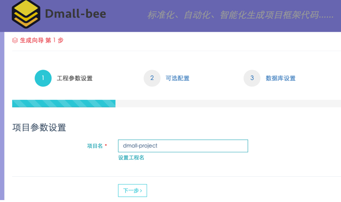

蜜蜂项目（Dmall-bee）
==================


### 访问入口 -> [http://bee.dmall.com/](http://bee.dmall.com/)

为了规范多点项目的开发，让所有的项目都能使用一致的项目框架结构，并以统一的方式使用中间件，让开发人员能在多个项目之间快速适应和切换，从而提升开发效率。蜜蜂项目应运而生(***利用业余时间开发***)，通过简单输入配置，`标准化、自动化、智能化生成项目框架代码`，最后打包下载。

### 主要功能如下：

- 自动按需生成统一标准的maven工程项目
  - SpringMVC + velocity + mybatis（web、service、dao等分层）
  - 可根据数据表结构自动生成基本的CURD代码和sqlmap.xml
  - 可选自动生成ERP鉴权集成代码和配置
  - 可选自动生成OOP集成代码和配置
  - 可选自动生成DSF的配置和依赖
  - 可选自动生成DMG的配置和示例代码
  - 可选自动生成DMC的配置和依赖
  - 可选自动导入DMALL_LOG配置
  - 自动生成配置中心Admiral的配置和依赖
- 所有组件按照最佳实践配置和使用，避免使用不当
- 生成的项目稍加配置(修改必要的APPCODE等)就能直接运行
- 从此开发人员多项目切换再也不用花时间熟悉项目工程，直接上手



### 蜜蜂项目地址：

```
$> git clone git@github.com:yefan813/self-bee.git
$> cd dmall-bee
$> mvn clean install tomcat:run
访问：http://127.0.0.1:8080/
```

### 后续目标

#### 1、按照多点的前台结构，生成一整套的增、删、改、查界面，具体包括

- 可以生成登录需要的方法和配置
- 可以根据配置的实体，生成对应的Controller，以及增删改方法
- 可以生成标准的一套增删改查界面（参见多点现有的页面样式）

#### 2、增加更多的中间件集成，以及提升集成便利度

- 和DSF打通，直接勾选需要的服务接口，并生成配置和代码
- 和DMG打通，直接勾选需要的TOPIC，并生成配置和代码


